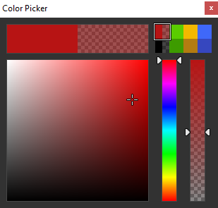
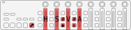

# ahk-nanokontrol2-color-picker

A color picker tool to be used with a MIDI controller that has at least four faders and a few buttons. The script is built for KORG nanoKONTROL2 device but can be customised for other devices. Optionally, after setting up a few hotkeys, it can even be used without a MIDI device.

## Functionalities

- It is a tool window that is always on top and not showing on the taskbar nor the Alt+Tab list
- There is a two dimensional saturation-value controller, and a hue and an alpha slider that can be set with the first four sliders of the MIDI controller in HSVA order.
- These can be changed with mouse as well (click and drag).
- The MIDI controller does its job even if the window is not active.
- There is a color holder rectangle that shows the current color.
- There are 8 swatches (saved colors), one of which is always selected and can be changed with the controls.
- All of the swatches are saved to an ini file on exit and loaded back on start.
- The swatches can be selected with the Solo 1 to 4 and Mute 1 to 4 buttons and also by clicking them.
- The current color holder and each swatch show the aplha as well. The left half shows the opaque color and the right half shows the color with alpha in front of a checkerboard pattern background.
- There are four MIDI buttons, that send the current color in different formats:
  - Rewind button: `rrggbb`
  - Fast forward button: `#rrggbb`
  - Stop button: `rrggbbaa`
  - Play button: `#rrggbbaa`
- The Record button can pick the color of the pixel where the cursor is. You can pick a color from anywhere on the screen.
- The Cycle button can be used to hide/show the tool window. The program keeps running in the background when the window is hidden.
- The buttons that have a function are lit so it's easier to find them. I don't know about other MIDI controllers but in the case of the nanoKONTROL2, this can be done by simply sending back the same note which the button is generating.

## Used libraries

- [MIDI in library by Micah Stubbs](https://github.com/micahstubbs/midi4ahk)
- [MIDI out library by TomB](https://autohotkey.com/board/topic/17212-midi-output-from-ahk/)
- [HSV-RGB conversion library by jballi](https://www.autohotkey.com/boards/viewtopic.php?t=30908)
- [GDI+ wrapper library by Uberi](https://github.com/Uberi/Canvas-AHK)

## How to use

- Clone the repo or download from the release page and run the [nanoKONTROL2_color_picker.ahk](./nanoKONTROL2_color_picker.ahk) script. 
  Please note that this script needs AutoHotkey version 1.1.31+ to run. 
- To use this tool with nanoKONTROL2 as is, you need to open [Korg Kontrol Editor](https://www.korg.com/us/support/download/software/0/159/1354/), change the Control Mode to CC, and without changing anything else write the data to the device. 
- If you are planning to use a different mapping or a different controller, that's cool too, you just have to change the MIDI hotkey mappings and the handler functions in the script accordingly. If you don't know what kind of MIDI messages your controller is generating, use a MIDI monitor like [MIDI-OX](http://www.midiox.com/) to find out.
- If you don't have a MIDI controller, you can also set up some hotkeys for the functions you want to use. Samples can be found towards the end of the script.

## Known issues

- The resolution of sliders and knobs on the nanoKONTROL2 is 128, and also on most MIDI devices, since the MIDI control change message value can only be 0 to 127. This means that the number of possible colors of this color picker tool is at most one eighth the number of all colors. However, it is still sufficient in most use cases.
- When changing between swatches, the physical faders or sliders don't change with it. This means, when moving a fader after a swatch change, it will jump in value. This issue can be solved with motorized faders or infinite knobs.

## Ways to improve

- Display hex and decimal values of the current color.
- Generalise the script to any MIDI controller, and store the contoller-specific data in config files.
- Eventually implement the motorized fader and/or infinite knob changes. I currently don't have a device to test this on, so I won't do this in the near future.
- Make the UI scaleable.

## [Version history](./VersionHistory.md)
