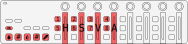

# ahk-nanokontrol2-color-picker

A color picker tool to be used with a MIDI controller that has at least four faders and a few buttons. The script is built for KORG nanoKONTROL2 device but can be customised for other devices.

## Functionalities

### version 1.0.0

- It is a tool window that is always on top and not showing on the taskbar nor the Alt+Tab list
- There are H, S, V, and A sliders that can be set with the first four sliders of the MIDI controller.
- The controller does its job even if the window is not active.
- There is a color holder rectangle that shows the current color.
- The third R button on the controller sends the current color code in the usual hexadecimal rrggbb format.
- The fourth R button sends the color with the alpha value in rrggbbaa format.
- The Record button can pick the color of the pixel where the cursor is. You can pick a color from anywhere on the screen.
- The buttons that have a function are lit so it's easier to find them. I don't know about other MIDI controllers but in the case of the nanoKONTROL2, this can be done by simply sending back the same note which the button is generating.

### version 1.0.1

- You can change the sliders with mouse as well (click and drag).

### version 1.0.2

- The current color is saved to an ini file on exit and loaded back on start.
- Added # versions of the color insertion. The third M button sends the current color with a #. The fourth M button sends the current color with aplha and a #.

## Used libraries

- [MIDI in library by Micah Stubbs](https://github.com/micahstubbs/midi4ahk)
- [MIDI out library by TomB](https://autohotkey.com/board/topic/17212-midi-output-from-ahk/)
- [HSV-RGB conversion library by jballi](https://www.autohotkey.com/boards/viewtopic.php?t=30908)

## How to use

Clone the repo and run the script. 
Please note that this script needs AutoHotkey version 1.1.31+ to run. 
To use this tool with nanoKONTROL2, you need to open [Korg Kontrol Editor](https://www.korg.com/us/support/download/software/0/159/1354/), change the Control Mode to CC, and without changing anything else write the data to the device. 
If you are using a different mapping or a different controller, that's cool too, you just have to change the MIDI hotkey mappings and the handler functions in the [script](./nanoKONTROL2_color_picker.ahk) accordingly. If you don't know what kind of MIDI messages your controller is generating, use a MIDI monitor like [MIDI-OX](http://www.midiox.com/).

## Caveats and ways to improve

- The resolution of sliders and knobs on the nanoKONTROL2 is 128, which means that the number of possible colors of this color picker tool is significantly lower than that of other traditional tools. Maybe I can use two controls for one data but that just sounds dumb.
- Color changing sliders. As you can see, currently the saturation and value sliders are not changing dynamically with the chosen color like in other color picker tools. While it is not essential for the program to function properly, it would be a nice addition. However, I can see no better options for this now than generating the images of the sliders on the fly. I have not done anything like that before, so it needs a bit of research.
- The nanoKONTROL2 has more faders, so it's totally possible to have another color, like foreground and background. I will definitely do this in the future because I find it particularly useful to save one color temporarily.
